# Forensics Challenges - Ethical Hacker Club
- Forensics cũng là một dạng mà mình practice khá nhiều, chắc nhiều hơn cả mảng web vì vậy sau khi thất bại ở chall web thì mình quay xe sang forensics ngay lập tức. Tiếc là ở mảng này mình lại mất quá nhiều thời gian vào các câu lý thuyết ☹ 

1.	*Hello Shark*
 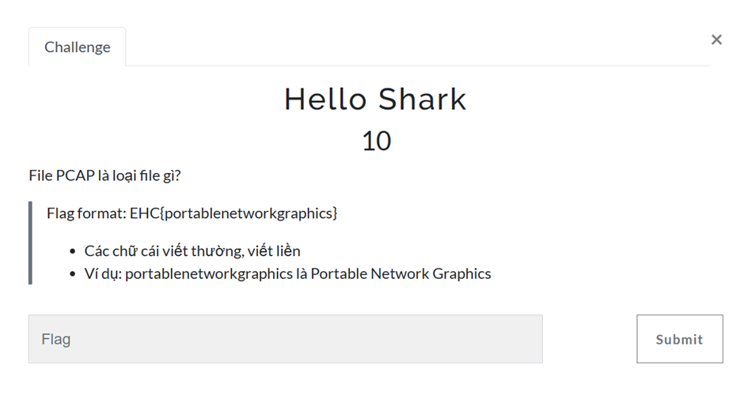
- Là một trong nhưng câu lý thuyết mình giải được, thì ở đây với kiến thức mình biết thì file pcap chính là viết tắt của từ Paket Capture Data vậy nên flag của bài này chính là : EHC{packetcapturedata}
2.	*Oh! Shark is cute!*
 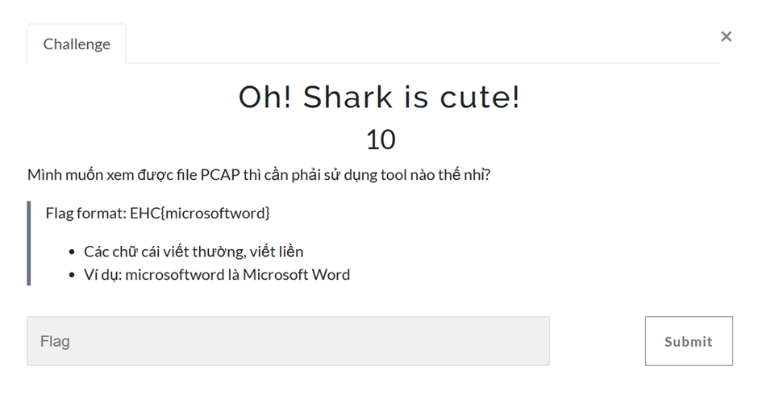
- Đây là một câu lý thuyết rất cơ bản và đáp án chính là wireshark. Vì vậy đáp án của flag này chính là : EHC{wireshark}
3.	*Comment more command*
 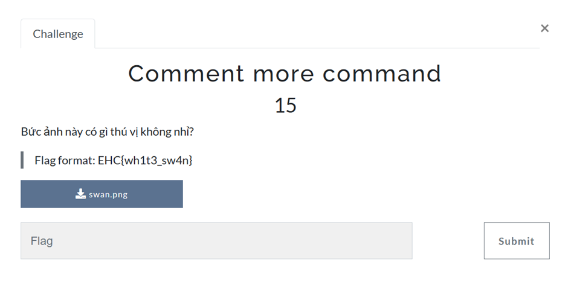
- Sau khi tải file swan.png và mở ra thì có hình chú thiên nga ở bên dưới
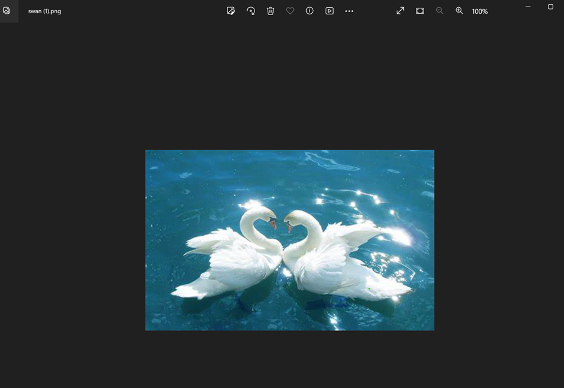
- Không có gì đặc biệt ở bức ảnh này cả vậy nên mình sẽ sử dụng HXD để xem bên trong có gì
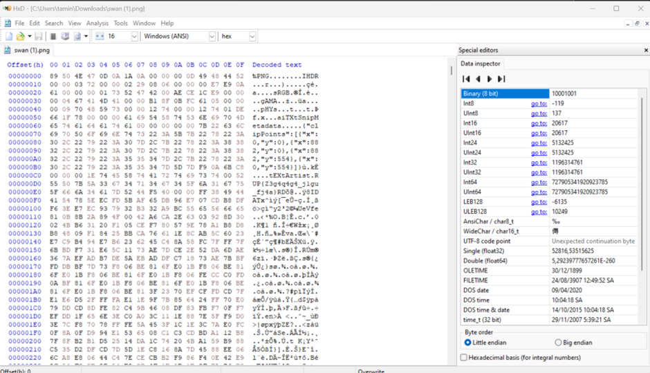
- Có vẻ như Header đúng signature của file png rồi. Ở End Chunk cũng không có xáo trộn hay thêm bớt gì cho nên mình sẽ chuyển qua vmware và sử dụng exiftool để kiểm tra metadata của nó xem có gì bất thường không
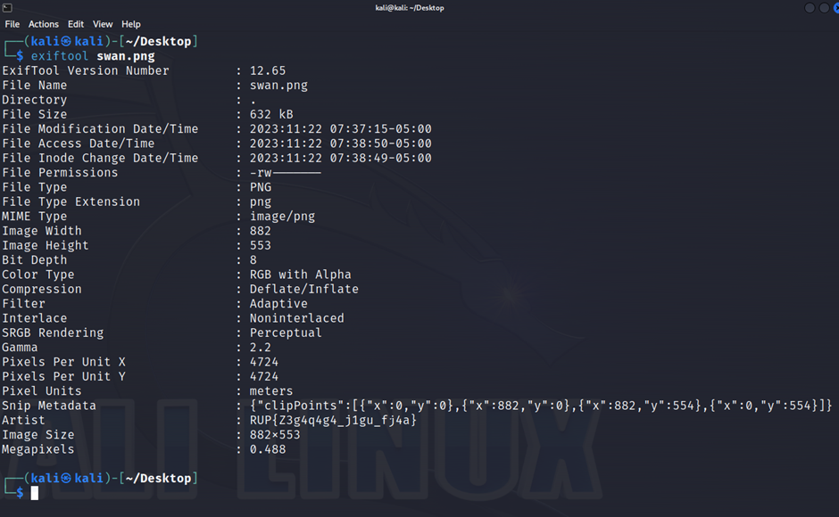
- Và mình đã tìm thấy flag ở phần artist nhưng flag đang bị encrypt và mình đoán đây là dạng cipher encryption. Vậy nên mình đã copy encrypted flag và mang lên cipher decoder online để decrypt và cho ra kết quả chính là flag mà mình cần tìm
 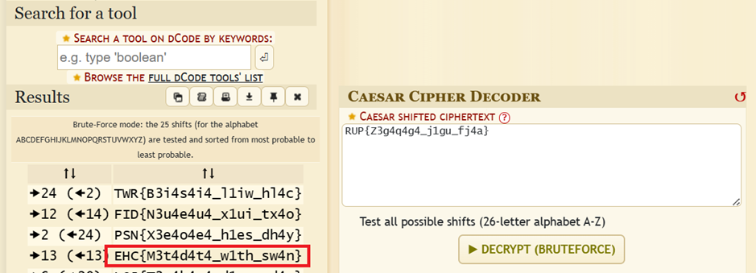
- *Flag : EHC{M3t4d4t4_w1th_sw4n}*
4.	*Cat&tulip. Hide&seek*
 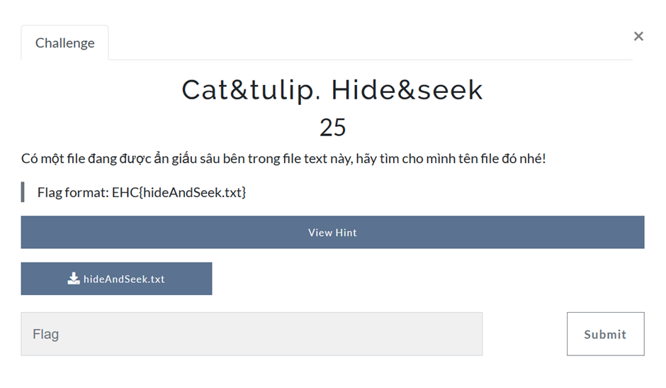
- Rất đang tiếc là chall này mình đã làm gần ra rồi nhưng do không để ý đề bài yêu cầu nên mình đã không nộp được flag ☹
Sau khi tải file hideAndSeek.txt về mình mở nó để xem và cho ra một đoạn text khá dài
 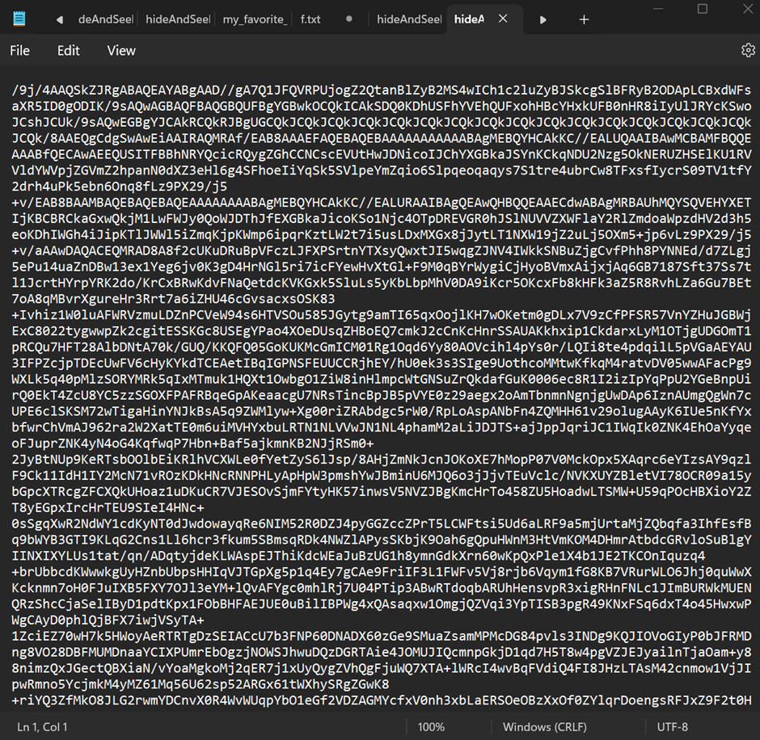
- Nhìn sơ qua thì có vẻ nó đang được mã hóa ở một dạng nào đó. Nhìn có vẻ rất giống base64 và theo kinh nghiệm của mình khi giải forensics thì đối với những bài có những đoạn text dài như này thì cứ copy paste lên các trang analyze ciphertext để xem chính xác nó ở dạng mã hóa nào.
 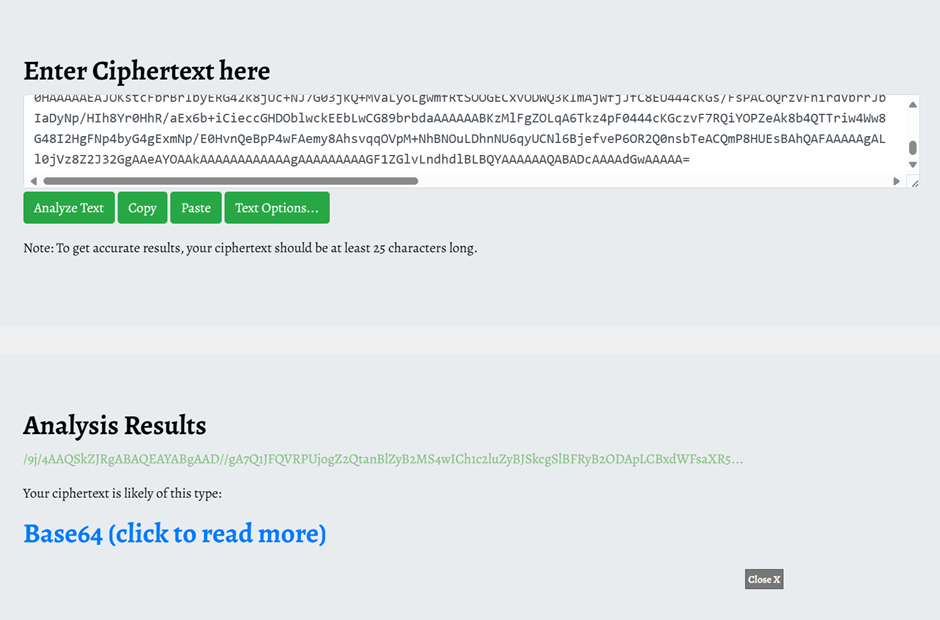
- Kết quả đúng như mong đợi nó đã analyze và xác định đoạn text này được mã hóa bằng base64. Copy text và decode bằng base64 thì mình đã có một đoạn text như sau :
 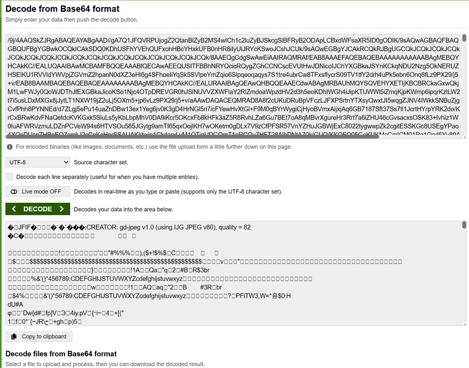
- Nhìn header thì đúng chính xác là file JPG rồi giờ mình sẽ lưu đoạn text decode này về và chuyển extension sang đuôi .jpg để xem nó là gì
 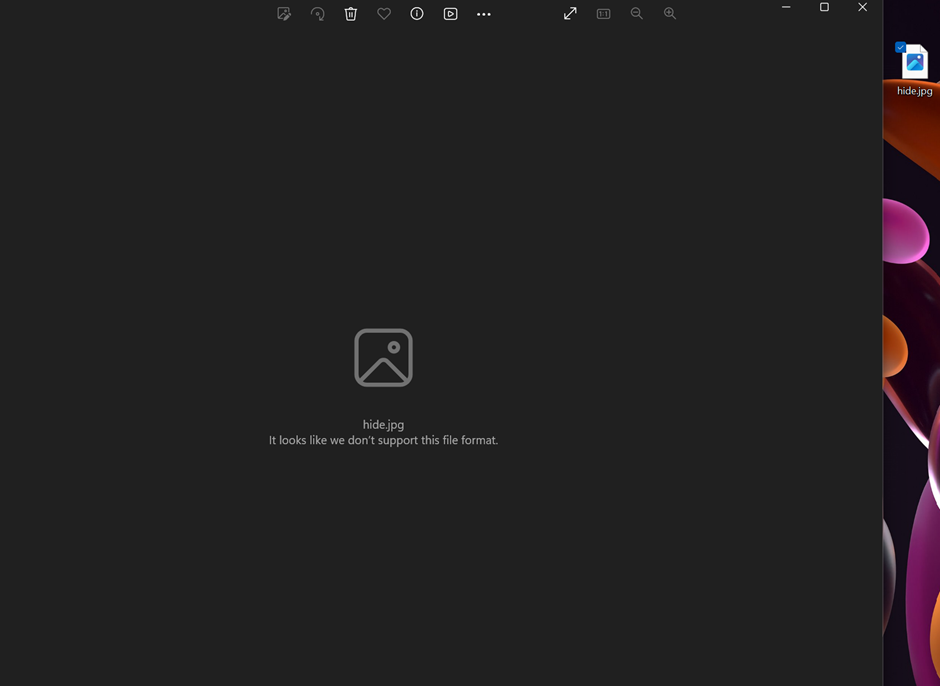
- Hmm có vẻ như file vẫn không thể xem được. Mình nghĩ rằng đây chắc chắn là base64 encode rồi nhưng mà có thể format của nó chưa chuẩn nên không thể xem. Vì vậy mình quay lại trang analyze lúc nãy và dùng luôn format mà trang đề xuất.
 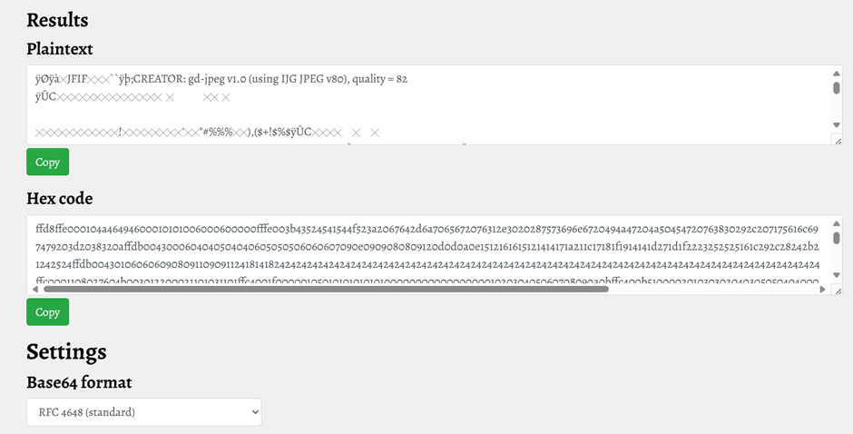
- Nhìn có vẻ okay rồi nên mình tải file decode xuống và đổi đuôi extension thành .jpg xem có mở được file không
 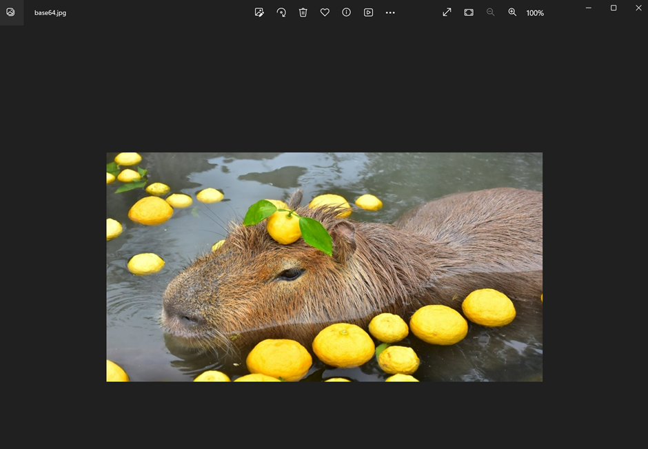
- Tada ta đã xem được hình ảnh bên trong rồi. Nhưng vấn đề là không có flag ở trong file ảnh này. Thời gian đang hết dần nên mình cắn răng dung hint nhưng mất 5 point ☹ 
 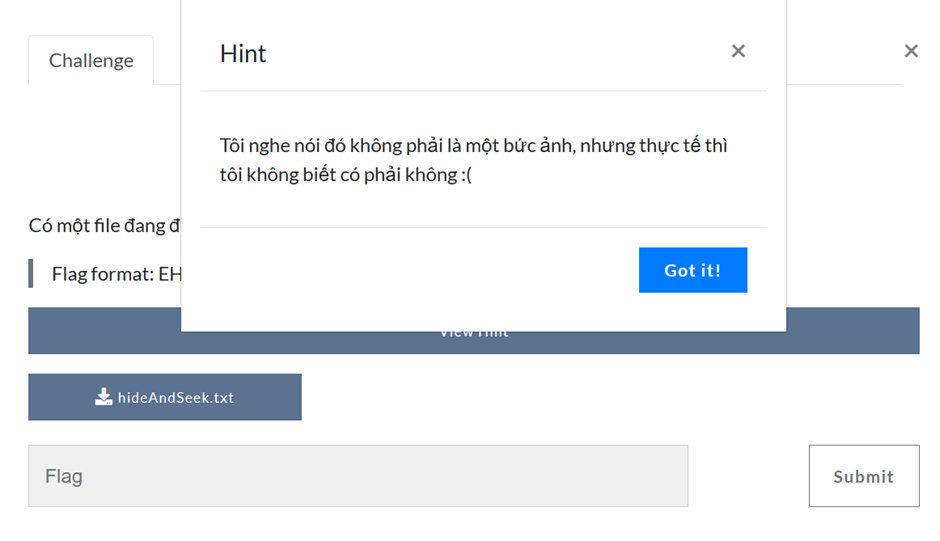
- Hint chỉ ra rằng đây không phải là một file ảnh. Mình nhận ra vấn đề và sử dụng hxd để kiểm tra file ảnh này
Mình kéo xuống end chunk thì nhận ra điều bất thường đó chính là file này có một file ảnh này chứa một file audio bên trong
 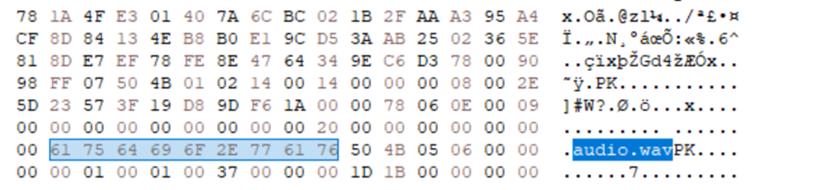
- Sai lầm của mình ở bài này chính là không đọc kỹ đề. Đề ở đây chỉ yêu cầu nhập flag là tên file bị ẩn và ở đấy chính là file audio.wav nhưng mình vẫn tiếp tục mở file audio.wav lên
 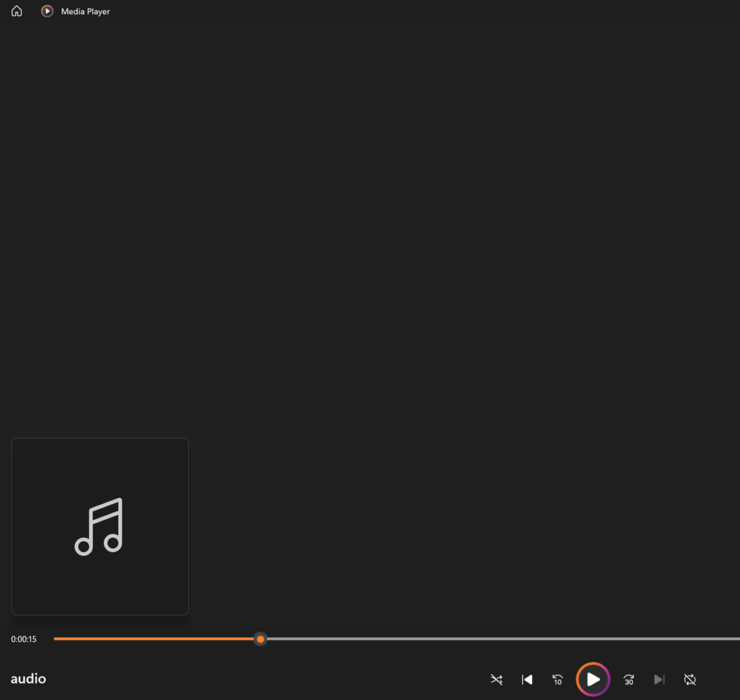
- Đây là một file âm thanh chứa mã morse dài 1 phút và mình ngay lập tức up lên trang web decode mã morse online và thu được một đoạn text : *EL04354467B64305F7930555F6B4E3057575F6830575F74305F52334445F6D307235335F433064333F7D*
Ném lên CyberChef thì không decode ra được gì cả cho nên mình đã bỏ qua bài này mặc dù flag đã rõ mồn một rồi ☹Về nhà ngẫm ra thì đã quá trễ rồi
- *Flag : EHC{audio.wav}*
# Các quest clear ở nhà xD
1. *Come to me FIRST!*
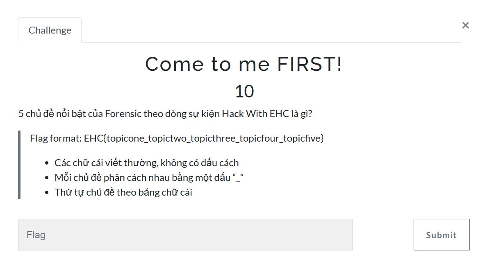
- Mình thực sự đã có cái nhìn khác về khả năng Google Dorking của mình. Mình luôn tự tin mình là vua searching cho đến khi đi thi Lmao :(((
- Chall này chỉ cần search trên youtube ở album HWE là ra rồi nhưng không hiểu sao lúc đấy mình làm trò mèo gì không biết huhu
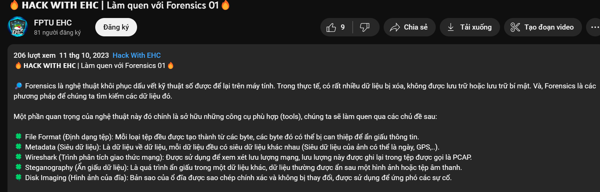
- Tổng hợp cùng các điều kiện lại thì flag của bài này chính là : *EHC{diskimaging_fileformat_metadata_steganography_wireshark}*
2. *Comment Command*
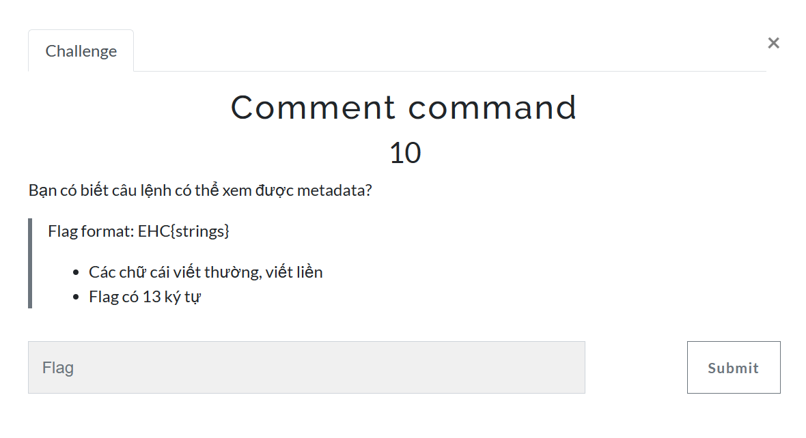
- Lại một câu lý thuyết mà mình không clear được. Câu này không làm được xứng đáng ăn một cái bạt tai vì nó thật sự quá dễ với một câu lý thuyết 10 point
- Mình thật sự khá lú với câu hỏi này vì trong linux có khá nhiều lệnh để xem metadata của một file như ls, stat... Nhưng mình lại khá phân vân khi đề hỏi là câu lệnh để xem metadata nên theo suy nghĩ của mình, đó phải là một standard command (nghĩa là command mặc định của OS). Vì vậy mình đã ngồi mò mẫm rất mất thời gian với câu này và khi về đến nhà, mình đã thử lại và kết quả lại là exiftool (một tiện ích được phát triển độc lập). Mình biết exiftool có thể xem được metadata nhưng phải cài đặt riêng. Nếu không cài đặt thì đâu thể sử dụng được :V
- Nói chung thì câu này làm mình mất time kha khá nên thôi flag của bài này là : *EHC{exiftool}*