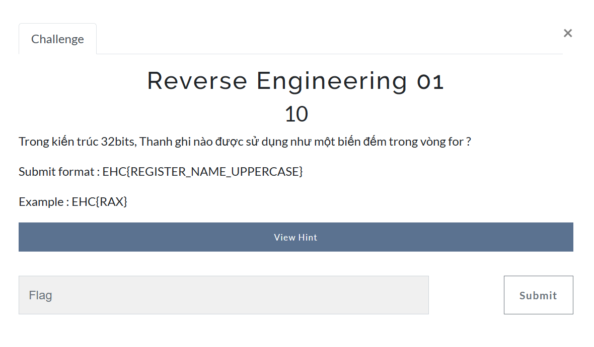
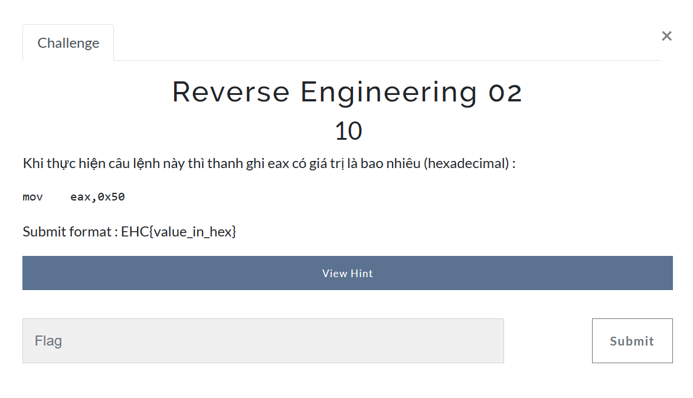
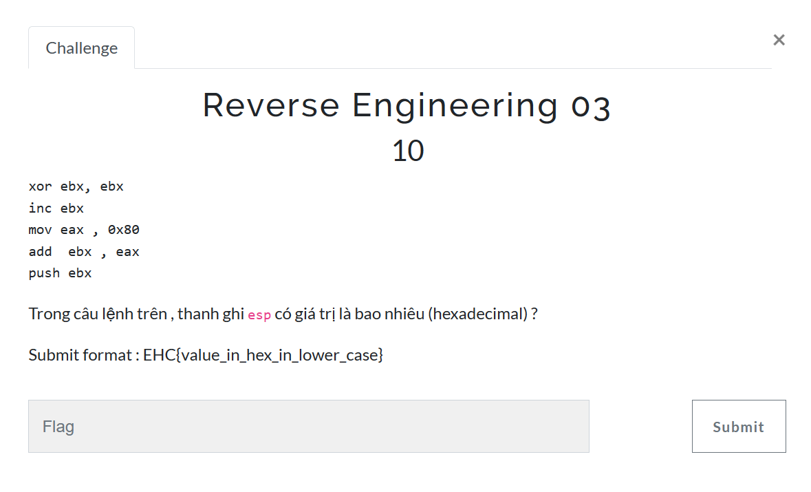
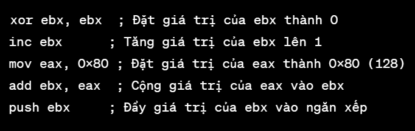
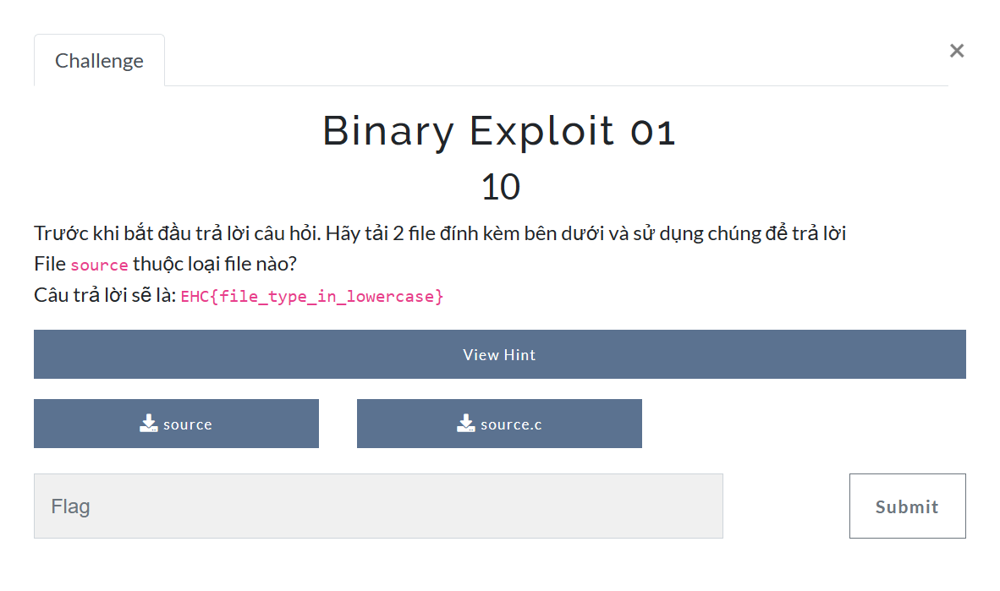
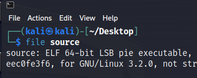
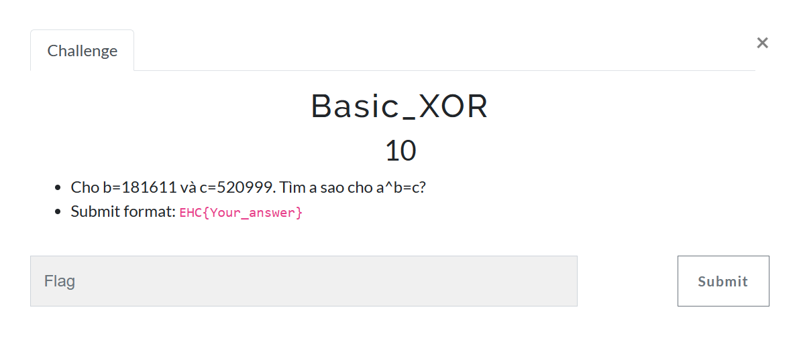
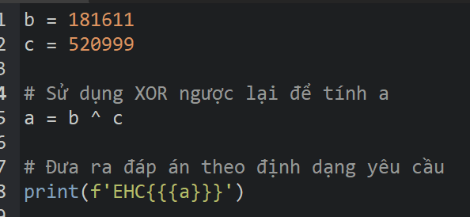

# RE + BE + Crypto Challenges - Ethical Hacker Club
- Đây là 3 mảng mình khá yếu và chưa có luyện tập quá nhiều đặc biệt là Crypto nên số chall mình giải được là không nhiều nên mình sẽ gộp writeup cả 3 mảng lại. Kỹ năng thực hành kém nên lý thuyết tất nhiên cũng không tốt. Vì vậy 3 mảng này để unlock các quest ẩn đòi hỏi phải có kiến thức lý thuyết nền tảng ví dụ đối với RE thì phải có kiến thức về ASM, Crypto thì cần có kiến thức về AES, DES, các mật mã cổ điển, xử lý chuỗi...

1. *RE01*

- Một câu hỏi lý thuyết về Arch 32bits, thì ở đây thanh ghi được sử dụng như một biến đếm vòng for chính là thanh ghi ECX. Vì vậy flag của bài này chính là *EHC{ECX}*
2. *RE02*

- Khi thực hiện câu lẹnh mov eax,0x50 thì thanh ghi eax sẽ có giá trị 50 trong hexadecimal (hoặc 80 đối với decimal) nên vì thế flag của bài này là *EHC{50}*
3. *RE03*

- Để biết thanh ghi esp có giá trị là bao nhiêu thì chúng ta sẽ thực hiện 5 câu lệnh như sau: 

Giá trị của thanh ghi esp sau khi thực hiện câu lệnh push ebx sẽ là địa chỉ của giá trị mới được đẩy vào đỉnh ngăn xếp. Do ebx là 0x80 (128) sau khi thực hiện add ebx, eax, nên giá trị của esp sẽ là 0x80. Vậy flag của bài này chính là *EHC{80}*
4. *BE01*

- Sử dụng lệnh file trong linux, mình có thể tìm được kiểu file của file source này chính là ELF file

- Vậy nên flag của bài này chính là *EHC{elf}*
5. *Basic XOR*

- Đối với bài tìm xor ngược này, mình đã sử dụng python để làm cho nhanh

- Vậy đáp án của flag này là : *EHC{341580}*