# Web Challenges - Ethical Hacker Club
- Là một người mới nên mình thường lựa chọn web để giải đầu tiên và mục tiêu là sẽ clear web. Nhưng có vẻ như vấn đề tâm lý khiến mình ngày hôm đó hóa Zeus 2022 và choke lòi kèn :( Nhưng thất bại đâu có nghĩa là sẽ mãi thất bại nên mình sẽ viết write-up này coi như dấu mốc đầu tiên trên con đường trở thành pro ctf :V

1. *Web 01*
 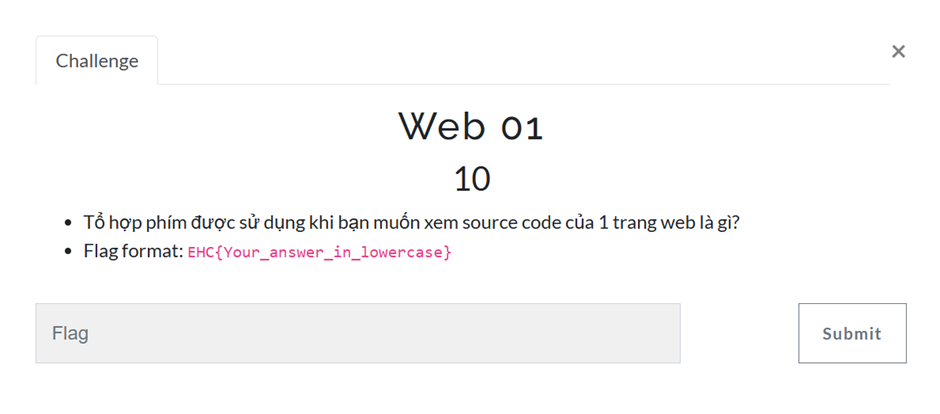
- Đây là một Chall mang tính lý thuyết. Tất nhiên để xem source code thì tổ hợp phím là CTRL + U nên vì vậy flag bài này là : EHC{ctrl_u}
2.	*Web 02*
 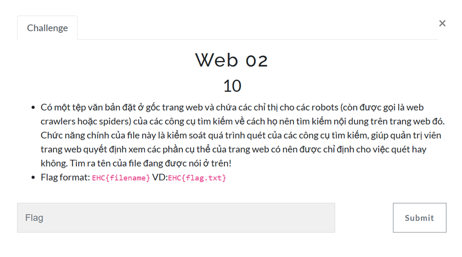
- Tiếp theo là một chall lý thuyết khác. Sau khi đọc phần mô tả của chall thì mình có thấy nhận thấy ngay được đáp án chính là file robots.txt nên vì thế flag của bài này chính là EHC{robots.txt}
3.	*Web 03*
 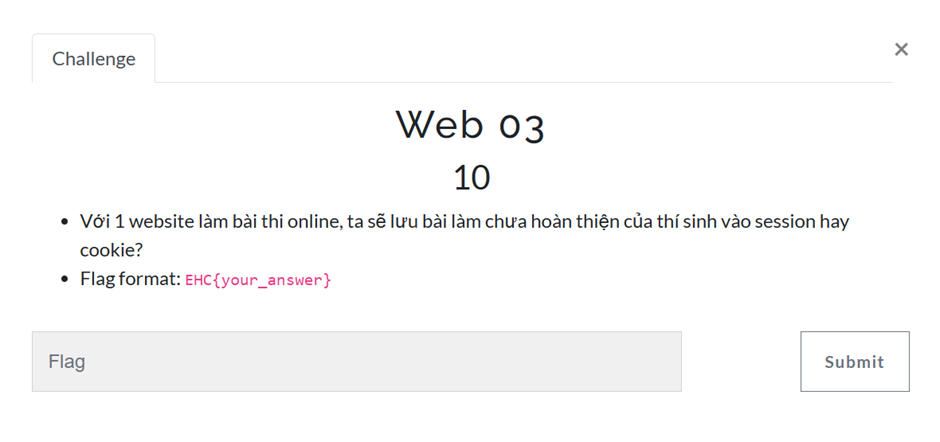
- Một câu hỏi lý thuyết về session và cookie. Sau khi đọc bài này, vận dụng một chút kiến thức cá nhân thì mình nhớ ra đối với session thì dữ liệu sẽ mất khi người dùng tắt trình duyệt. Còn cookie thì được lưu trên server của hệ thống nên không cần chờ đợi nhiều mình đã đoán được flag của bài này là *EHC{cookie}*
4.	Web 04
 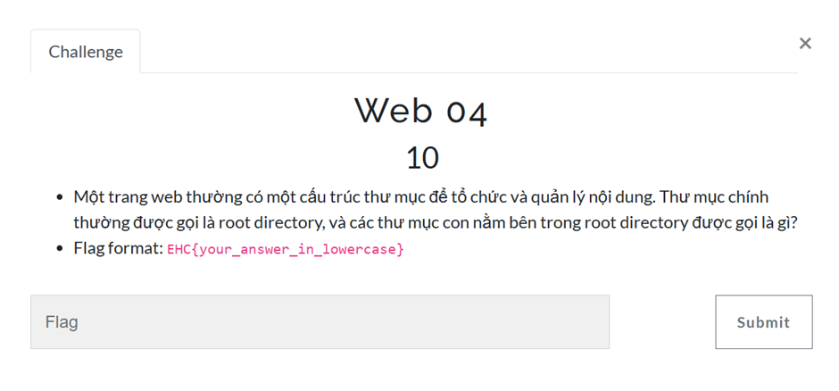
- Tiếp tục là một chall lý thuyết về cấu trúc của folder trong OS. Đối với thư mục chính thì sẽ được gọi là Root Directory, các thư mục con nằm ở bên trong thư mục gốc thì còn gọi là subfolders. Vì vậy mình sẽ suy ra ngay flag của bài này chính là *EHC{subfolders}*
5.	Web 05
 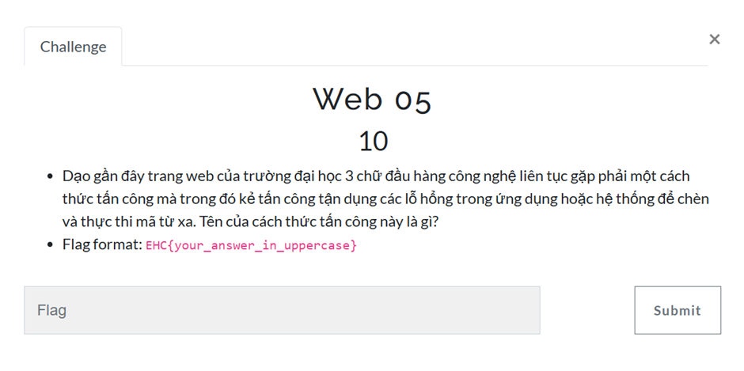
- Đọc phần mô tả của chall này thì mình đoán ngay đây chính là phương pháp RCE vì chèn mã độc và thực thi nó chính là điểm nổi bật nhất của RCE mà 😊 Vậy nên đáp án của flag này chính là EHC{RCE}
6.	Web 06
 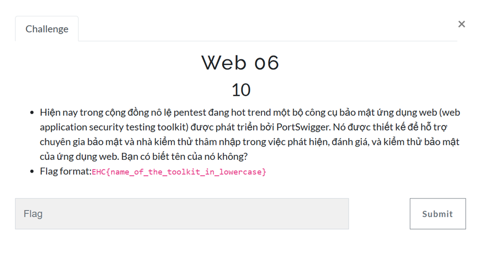
- Một phần mềm mà 10 người pentest thì 11 người dùng chắc chắn không gì khác ngoài Burpsuite vậy nên đáp án của flag này là *EHC{burpsuite}*
7.	C0ntr0l U
 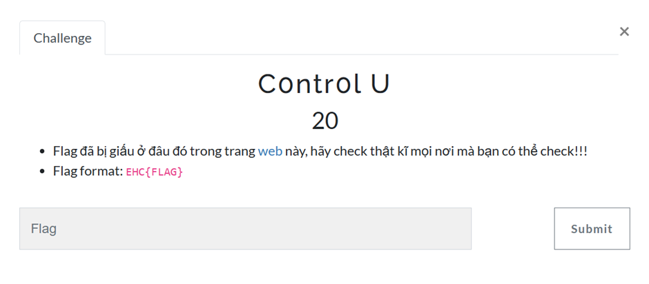
- Khi truy cập vào trang web thì mình thấy chả có gì ngoài một đoạn text
 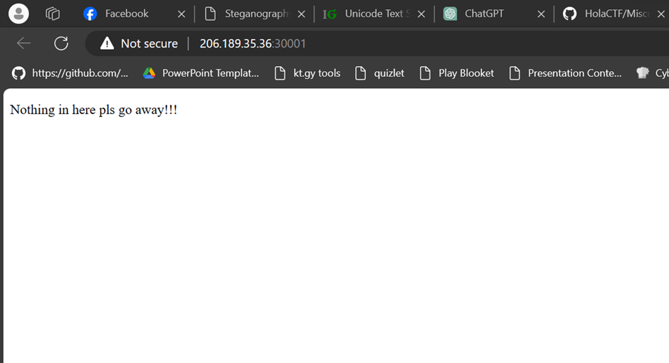
- Mình thử xem source web thì tada đã tìm thấy flag 
 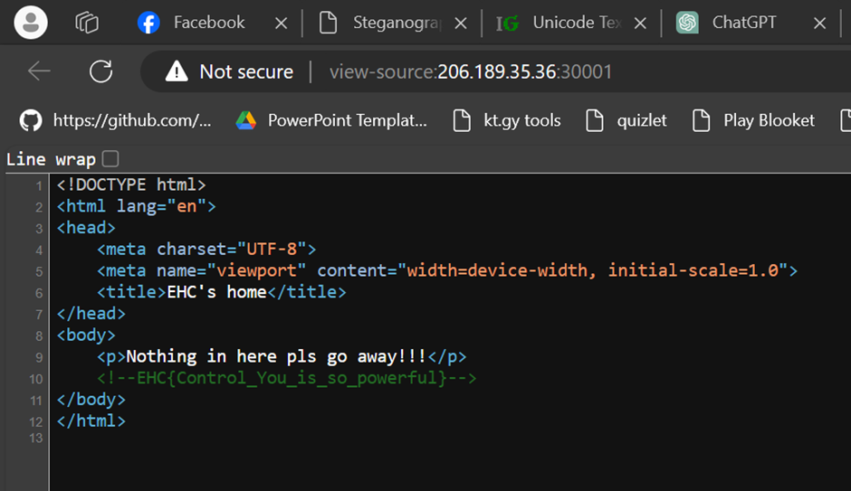
- *Flag : EHC{Control_You_is_so_powerful}*
8.	Hidden Text!!!
 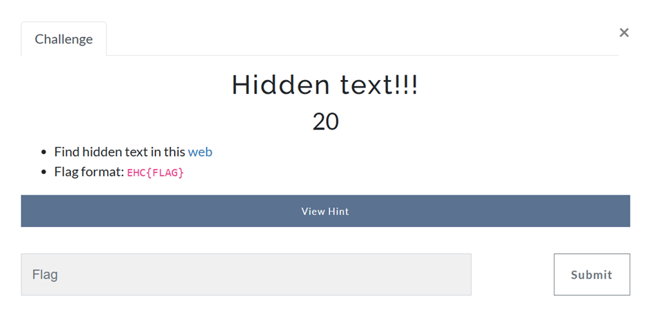
- Khi mình truy cập vào trang web thì có một đoạn text “I need to find some robots” vì thế nên mình nghĩ ra ngay đó chính là truy cập vào file robots.txt và bùm mình đã có flag
 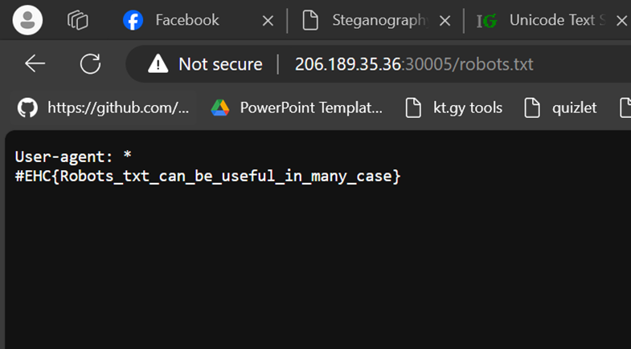
- *Flag : EHC{Robots_txt_can_be_useful_in_many_case}*
